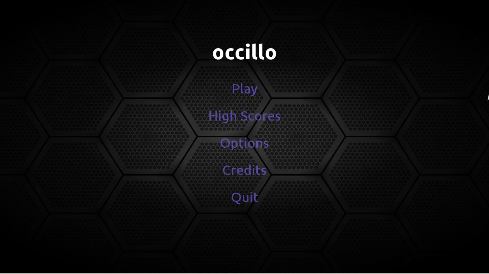
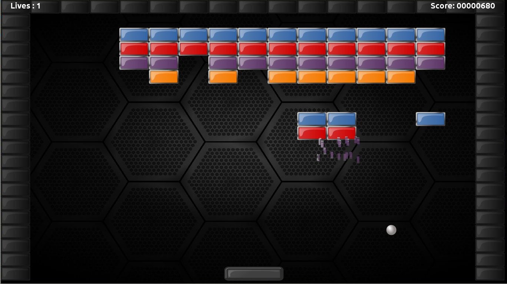
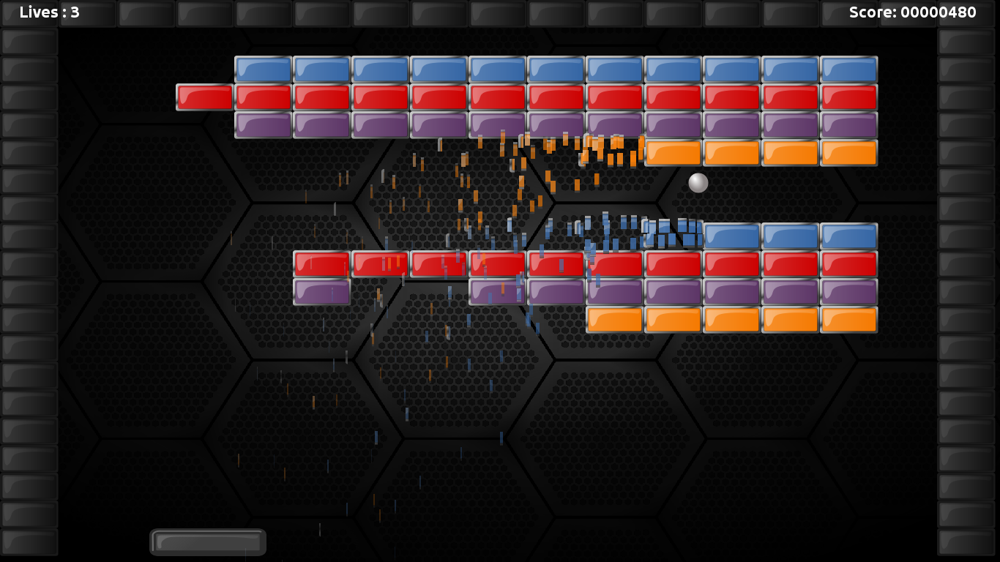

# A breakout style arcade game and engine.

## Features

* 20 Levels.
* Mouse, keyboard or gamepad control.
* SVG graphics for hi-dpi displays.
* Rocking soundtrack...

## Screenshots

  
  
  
  

    
&#10094;

    
&#10095;

  

  

    
    
    
  

## Requirements

* GNU/Linux, Apple OS X 10.10+, Microsoft Windows 7+, Solaris 11/OpenIndiana
* Intel Atom N570 or better.
* 2GB RAM.
* 50MB HDD space.
* 640x480 32bit colour display.

## Downloads

### Binary Releases

There are currently no binary releases available. Current source code can be downloaded here: 
[Occillo Github Project](https://github.com/dkartaschew/occillo).

## Support and Discussion Boards

Support and Discussion Boards can be found on the github project page located here:
[Occillo Github Project](https://github.com/dkartaschew/occillo/issues).

